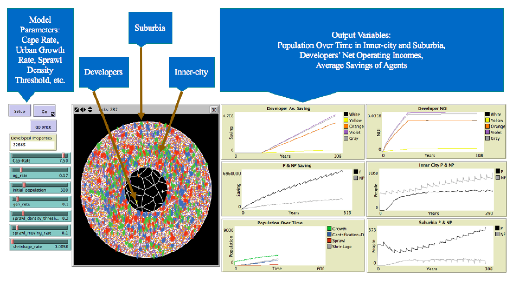

# Capturing the Effects of Gentrification on Property Values: An Agent-Based Modeling Approach

Paper and model preseanted at the 2019 Computational Social Science Society of Americas Conference.

Below you can see the Graphical User Inteface (GUI) for the model (see oringal model (NetLogo 5.3.1  [Land_Market.nlogo](Land_Market.nlogo) or an updated model for NetLogo 6.1.0 [Land_Market_6_1.nlogo](Land_Market_6_1.nlogo)).

**Abstract**

Cities are complex systems which are constantly changing because of the interactions between the people and their environment. Such systems often go through several life cycles which are shaped by various processes. These may include urban growth, sprawl, shrinkage, and gentrification. These processes affect the urban land markets which in turn affect the formation of a city through feedback loops. Through models we can explore such dynamics, populations, and the environments in which people inhabit. The model proposed in this paper intends to simulate the aforementioned dynamics to capture the effect of agents’ choices and actions on the city structure. Specifically, this model explores the effect of gentrification on population density and housing values. The proposed model is significant in its integration of ideas from complex systems theory which is operationalized within an agent-based model stylized on urban theories to study gentrification as a cause of increased in land values. The model is stylized on urban theories and results from the model show that the agents move to and reside in properties within their income range, neighboring agents that have similar economic status. The model also shows the role of gentrification by capturing both the supply and demand aspects of this process in the displacement and immobilization of agents with lower incomes. This is one of the first models that combines several processes to explore the life cycle of a city through agent-based modeling.

**Keywords**: Urban Dynamics, Land Markets, Gentrification, Urban Growth, Urban Shrinkage, Urban Sprawl.

## Full Reference & Access to the Paper

**Bagheri-Jebelli, N., Crooks, A.T. and Kennedy, W.G.** (2019), Capturing the Effects of Gentrification on Property Values: An Agent-Based Modeling Approach, The Computational Social Science Society of Americas Conference, Santa Fe, NM ([PDF of Paper](./paper.pdf)).

## Movie of a Simulation Run

If you click on the image below, you will be taken to YouTube where you can see a run of the model. Alternatively see: [https://youtu.be/VppgZlZa4Vg](https://youtu.be/VppgZlZa4Vg).

